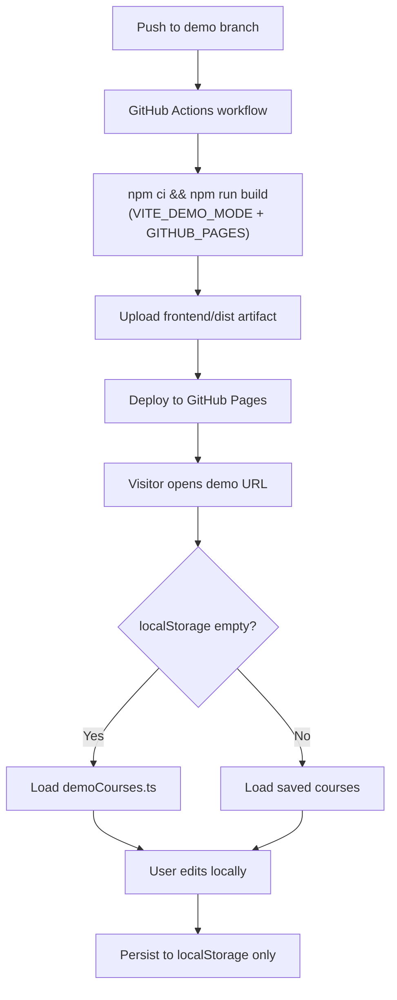

# Demo GitHub Pages Publish Plan

## Goal

Publish a live demo at **`https://amirmahdikahdouii.github.io/learn-tracker/`** from a new **`demo`** branch. First-time visitors get bundled dummy courses; all edits persist in each user's browser via existing `localStorage` — no cross-user sharing.



## Branch strategy

1. Create `demo` from current `master`.
2. Apply all demo-specific changes on `demo` (master stays unchanged for local dev).
3. Ongoing: merge `master` → `demo` when syncing new features; push to `demo` triggers redeploy.

## File changes (all on `demo` branch)

### 1. Vite base path for project Pages

Update [`frontend/vite.config.ts`](frontend/vite.config.ts) to serve assets under the repo subpath:

```ts
base: process.env.GITHUB_PAGES === 'true' ? '/learn-tracker/' : '/',
```

Local dev and `master` remain at `/`. The workflow sets `GITHUB_PAGES=true` only for production demo builds.

### 2. Demo mode env typing

Extend [`frontend/src/vite-env.d.ts`](frontend/src/vite-env.d.ts):

```ts
interface ImportMetaEnv {
  readonly VITE_DEMO_MODE: string
}
```

Workflow and local preview set `VITE_DEMO_MODE=true`; absent/false on `master`.

### 3. Bundled seed data

Add [`frontend/src/data/demoCourses.ts`](frontend/src/data/demoCourses.ts) exporting a `Course[]` constant matching [`frontend/src/types.ts`](frontend/src/types.ts).

Suggested content (stable UUIDs, not regenerated at runtime):

- **2–3 courses** with different providers (e.g. Udemy, Coursera, Maktabkhoone)
- **Multiple chapters** per course with realistic section titles
- **Mixed `isCompleted` values** so dashboard and chapter progress bars look meaningful (~30–60% overall on at least one course)
- Optional `url` fields pointing to example.com (not real course links)

Structure mirrors the template in [`frontend/src/App.vue`](frontend/src/App.vue) `downloadTemplate()`.

### 4. Seed on first visit only

Add a `seedDemoIfNeeded()` action to [`frontend/src/stores/courseStore.ts`](frontend/src/stores/courseStore.ts):

```ts
seedDemoIfNeeded() {
  if (import.meta.env.VITE_DEMO_MODE !== 'true') return
  if (this.courses.length > 0) return
  this.courses.push(...structuredClone(DEMO_COURSES))
}
```

- Gate on `VITE_DEMO_MODE` so non-demo builds are unaffected.
- Only seed when `courses.length === 0` (empty `localStorage` key `local-first-courses`).
- Use `structuredClone` (or spread) so seed objects are not shared references.

Call from [`frontend/src/main.ts`](frontend/src/main.ts) after `createPinia()` and before `app.mount()`:

```ts
const pinia = createPinia()
app.use(pinia)
useCourseStore(pinia).seedDemoIfNeeded()
app.mount('#app')
```

No changes to existing actions (`toggleSectionCompletion`, `importCourses`, etc.) — they already persist via `useStorage`.

### 5. Demo UX (minimal)

Update [`frontend/src/App.vue`](frontend/src/App.vue) when `import.meta.env.VITE_DEMO_MODE === 'true'`:

- **Info banner** below the header: e.g. "Demo mode — changes are saved only in this browser."
- **Reset demo data** button (optional but recommended): calls a new store action `resetDemoData()` that replaces `courses` with a fresh clone of `DEMO_COURSES` — lets returning visitors restart without clearing browser storage manually.

Keep styling consistent with existing Tailwind/dark-mode patterns.

### 6. GitHub Actions deploy workflow

Add [`.github/workflows/deploy-demo.yml`](.github/workflows/deploy-demo.yml):

| Setting | Value |
|---------|-------|
| Trigger | `push` to `demo` branch |
| Permissions | `contents: read`, `pages: write`, `id-token: write` |
| Concurrency | `group: pages`, `cancel-in-progress: false` |
| Working directory | `frontend` |

Steps:

1. Checkout repo
2. Setup Node (LTS, e.g. 22) with npm cache on `frontend/package-lock.json`
3. `npm ci`
4. `npm run build` with env: `VITE_DEMO_MODE=true`, `GITHUB_PAGES=true`
5. `actions/upload-pages-artifact@v3` — path: `frontend/dist`
6. `actions/deploy-pages@v4` — deploy to `github-pages` environment

Uses the official artifact-based Pages flow (no committed `dist/`, no orphan `gh-pages` branch).

### 7. README demo section

Add a **Live demo** section to [`README.md`](README.md) on `demo` branch:

- URL: `https://amirmahdikahdouii.github.io/learn-tracker/`
- Note: demo branch auto-deploys on push; data is per-browser

## Manual setup (one-time, in GitHub UI)

After the first workflow run, configure the repo:

1. **Settings → Pages → Build and deployment → Source:** GitHub Actions
2. Confirm the deployment environment `github-pages` is created (Actions creates it on first deploy)

No custom domain required unless you add one later.

## Verification checklist

Before considering done:

1. **Local demo build preview** (from `frontend/`):
   ```bash
   VITE_DEMO_MODE=true GITHUB_PAGES=true npm run build && npm run preview
   ```
   Open preview URL — confirm assets load, dummy courses appear on first visit, toggling sections persists on refresh.

2. **Local dev unchanged**: `npm run dev` without env vars — empty dashboard, no banner.

3. **Type-check**: `npm run lint` passes.

4. **After push to `demo`**: Actions workflow succeeds; live URL loads app (not blank page — confirms base path is correct).

5. **Second browser / incognito**: each gets independent seed data; edits in one do not affect the other.

## What stays out of scope

- No backend or shared database
- No changes to `master` (unless you later choose to merge demo infra back for easier maintenance)
- No custom domain setup
- No changes to `utils/maktabKhooneCourseExtractor`

## Maintenance note

Because demo-only code lives on `demo`, feature work on `master` should be merged into `demo` periodically:

```bash
git checkout demo
git merge master
git push origin demo   # triggers redeploy
```

If drift becomes painful later, consider merging the env-gated seed logic into `master` (inactive by default) while keeping the workflow trigger on `demo` only.
