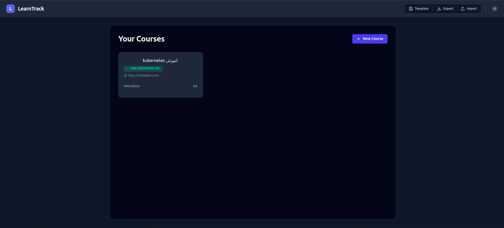
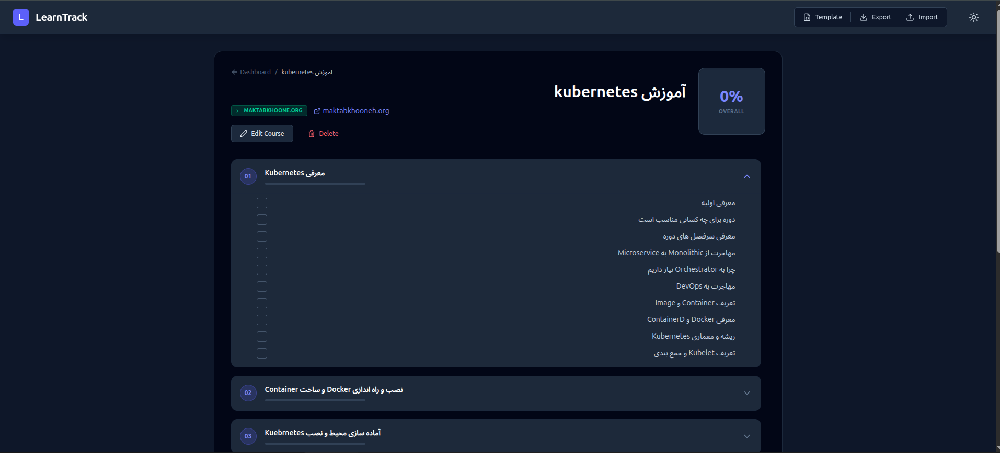

# LearnTrack

LearnTrack is a simple, local-first course progress tracker. Add the online courses you're taking, break each one down into chapters and sections, and check off sections as you complete them to see your progress per chapter and per course. All data is stored in your browser's `localStorage` — there's no account or backend, and you can export/import your courses as JSON to back them up or move them between browsers.

Features:
- Track multiple courses, each with a title, provider (e.g. Udemy, Coursera), and URL
- Organize each course into chapters and sections, with per-chapter and overall progress bars
- Toggle section completion with a click
- Dark mode
- Export all courses to a JSON file, import them back in (with automatic de-duplication), or download a blank JSON template to hand-author a course

## Screenshots

**Dashboard** — see all your courses and their progress at a glance:



**Course page** — drill into chapters and check off sections as you complete them:



## Live demo

Try LearnTrack in your browser (no install required): **[https://amirmahdikahdouii.github.io/learn-tracker/](https://amirmahdikahdouii.github.io/learn-tracker/)**

The demo loads sample courses on first visit. You can edit, track progress, and import/export JSON — all changes are stored in your browser only. Pushes to the `demo` branch auto-deploy via GitHub Actions.

## Development

The app lives in [frontend/](frontend/).

```bash
cd frontend
npm install
npm run dev
```

This starts the Vite dev server at `http://localhost:3000`.

Other useful commands (run from `frontend/`):

```bash
npm run build     # production build
npm run preview   # preview the production build locally
npm run lint      # type-check the project (tsc --noEmit)
```

## Utility scripts

[utils/maktabKhooneCourseExtractor/](utils/maktabKhooneCourseExtractor/) is a Python script that scrapes a course outline from [maktabkhoone.org](https://maktabkhoone.org) and converts it into a JSON file you can import directly into LearnTrack, instead of manually entering chapters and sections. See its [README](utils/maktabKhooneCourseExtractor/README.md) for setup and usage.
